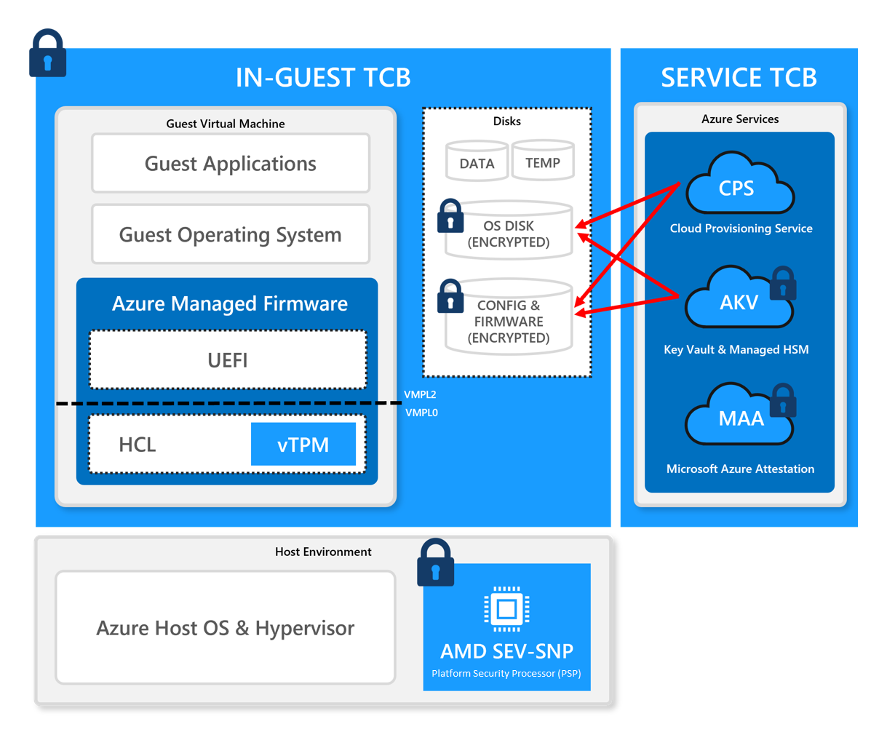

# Azure Confidential VMs attestation guidance & FAQ

## Introduction

CVMs offer added confidentiality and integrity for your workloads. The runtime state of these VMs is fully encrypted, protecting data even while in use (in memory or in registers, for example). Based on [AMD SEV-SNP](https://developer.amd.com/sev/), which provides memory encryption and various memory integrity protections for VMs, we have architected CVMs to dramatically reduce trust in the hosting software and cloud environment. To establish trust, the guest VM can rely on security guarantees and cryptographic measurements rooting up to the AMD processor.

_More information on AMD SEV-SNP technology can be found in [this](https://www.amd.com/system/files/TechDocs/SEV-SNP-strengthening-vm-isolation-with-integrity-protection-and-more.pdf) whitepaper from AMD._

## CVM Architecture



This diagram illustrates the high-level components that make up a CVM. As depicted in the diagram, the root-of-trust for the CVM is AMD’s PSP (Platform Security Processor).

As shown in the diagram above, HCL, vTPM and UEFI make up the firmware components for a CVM with Azure default firmware. These firmware components are provided and managed by Microsoft and are currently closed source.

## Host Compatibility Layer (HCL) and Virtual TPM (vTPM)

The HCL is a Microsoft-built virtualized firmware environment running within the context of the CVM, but outside the guest OS. The HCL hosts para-virtualized devices including a vTPM device, which is a secure virtualized implementation of a [TPM 2.0](https://docs.microsoft.com/en-us/windows/security/information-protection/tpm/trusted-platform-module-overview).

## Guest Attestation

[Guest Attestation](https://learn.microsoft.com/en-us/azure/confidential-computing/guest-attestation-confidential-vms) is a mechanism available for you to remotely verify the trustworthiness of your instantiated CVM, including cryptographic verification that HW-rooted SNP protection is
enabled on your CVM, to shield your CVM workload from Azure operators and Azure hosts. The remote verification is conducted by the [Microsoft Azure Attestation](https://learn.microsoft.com/en-us/azure/attestation/overview) (MAA) service. If you use
MAA, you need to implicitly trust that MAA is correctly validating the SNP report and is free from malicious intentions. While MAA follows industry-standards and Microsoft leads the CCC Attestation SIG, MAA remains closed-source.

Please spend a few minutes watching this [video](https://youtu.be/M7kWKN7fXbs) for a brief introduction on how guest attestation works, and what the attestation claims emitted by MAA mean.

Guest attestation can be accomplished via two mechanisms: a [Microsoft-built client library](https://github.com/Azure/confidential-computing-cvm-guest-attestation) (DLL or shared object) and Microsoft VM extension. The client library transparently obtains the report
and conducts remote attestation flows. Remote attestation via client library can be done programmatically using API, or a wrapper executable. The client library is open source. The VM extension is called “Guest Attestation Extension” that transparently obtains the report and conducts remote attestation flows, optionally providing the status of attestation in Microsoft Defender for Cloud. Both client library and guest attestation mechanisms gather evidence for
attestation associated with the Trusted Execution Environment (TEE) that is rooted to the CPU manufacturer (AMD).

You may or may not choose to trust the MAA service to attest your CVMs. You also may or may not choose to trust the HCL firmware that intercepts every call into the AMD SEV-SNP-enabled hardware. Depending on your willingness to trust Microsoft-owned components and services, below are Microsoft’s recommendations.

| Are you willing to trust MAA? | Are you willing to trust HCL? | Recommendation |
| --- | --- | --- |
| Yes | Yes | Use CVM with default firmware with multiple options (client library or attestation extension, see above) for guest attestation
| No | Yes | Fetch SNP reports using virtual TPM APIs as described in the FAQ

# Customer FAQ

### What is an AMD SEV-SNP report?

The AMD processor can provide cryptographically signed evidence of enablement of the SEV-SNP feature through a SEV-SNP report. This is important evidence in verifying confidentiality of the VM.

### What is an AMD VCEK (Versioned Chip Endorsement Key) certificate?

In SEV-SNP, the version numbers of all TCB components are combined with a fused secret called the Chip Endorsement Key to create a VCEK. It is a private ECDSA key which is unique to each AMD chip, running a specific TCB version. This VCEK is used for signing SEV-SNP reports.

You can obtain the VCEK certificate by following the instructions here:

[Versioned Chip Endorsement Key (VCEK) Certificate and KDS Interface Specification (amd.com)](https://www.amd.com/system/files/TechDocs/57230.pdf)

### I don’t trust MAA or the library you are asking me to install in my VM, but I do trust the underlying HCL firmware. How can I fetch and verify raw AMD SEV-SNP report on my own?

The mechanism to fetch the report is described below.

# Linux

1. For cryptographic verification, install the tpm2-tss library, which is a widely used open source
    TPM software stack – all the relevant OS distribution instances supported by CVMs have
    associated instructions at the link below.
    - https://github.com/tpm2-software/tpm2-tss/blob/master/INSTALL.md
       (For Ubuntu OS, use newer instructions from Canonical site -
       https://packages.ubuntu.com/source/focal-updates/tpm2-tss. Download tpm2-tss
       zipped archive and follow instructions in INSTALL.md)
    - Install tpm2-tools (sudo apt install tpm2-tools)
2. Obtain the VCEK certificate by running the following command – it obtains the cert from a [well-known IMDS endpoint](https://learn.microsoft.com/en-us/azure/virtual-machines/windows/instance-metadata-service?tabs=windows):
    % curl -H Metadata:true
    [http://169.254.169.254/metadata/THIM/amd/certification](http://169.254.169.254/metadata/THIM/amd/certification) > vcek

```
% cat ./vcek | jq -r '.vcekCert , .certificateChain' > ./vcek.pem
```

3. Extract the raw SNP report from the vTPM NVRAM (that was pre-generated by the HCL at
    boot) by executing the following command which will dump the report in binary form. Note
    that this is **not** a dynamically generated report.
```    
% tpm2_nvread -C o 0x01400001 > ./snp_report.bin
% dd skip=32 bs=1 count=1184 if=./snp_report.bin of=./guest_report.bin
```
_Note_ : Once the VCEK cert and SNP report are available, the steps below can be done on any
other trusted CVM or non-CVM machine.

4. Install the AMD SEV-Tool utility following the instructions here: [GitHub – AMDESE/sev-tool: AMD SEV Tool](https://github.com/AMDESE/sev-tool), and contact AMD for support.
5. Use AMD SEV-Tool to parse the report (to obtain the information that SNP is enabled). Note:
    sevtool binary is in the <repo root>/src folder.

```
% sudo ./sevtool –-ofolder <location of vcek.pem & guest_report.bin> --validate_guest_report
```
If you see the below output, it means that the SNP report is valid, and that HCL has
cryptographically verified that it is running on a genuine AMD processor and that SNP is
enabled for confidentiality on this processor.

```
Guest report validated successfully! 
```
    
It is important to note that the SNP report only certifies/measures the HCL (Microsoft firmware) and UEFI binary. You will not be able to generate arbitrary SNP reports by directly calling hardware APIs.

# Windows

Instructions to be updated soon.

### With CVMs, I want to build the guest attestation client library for Fedora based Linux. Is the source code available for attestation client library?

The overall guest attestation feature is open source. Source code for guest attestation client library will be available soon [here](http://aka.ms/cvmattestation).

### With CVMs, the baseline policy for attestation does not meet my needs. Can I create a custom attestation policy?

Yes. You can create a separate Microsoft Azure Attestation resource instance and modify the attestation policy to suit your needs. Instructions on how to create custom policy is [here](https://learn.microsoft.com/en-us/azure/attestation/author-sign-policy).

### With CVMs, can I use the claim ‘x-ms-sevsnpvm-launchmeasurement’ to prove code integrity over the initial state of a CVM?

This claim will change often, and it is not recommended to use this as a basis for code integrity
assurance.

### With CVMs, will ‘x-ms-sevsnpvm-idkeydigest’ be stable or can it change? If so, how often do you expect it to change?

The current key hash will be stable for 1 year, we are working lengthening the key life and will circle back with you upon request.

### For CVMs, is there a way to validate that this is an Azure VM by only looking at the 'x-ms-sevsnpvm' fields?

You can use the **_x-ms-compliance-status = azure-compliant-cvm_** claim. This claim should only be checked in a CVM guest attestation token. This presence of this claim in guest attestation token proves that the CVM is running on SEV-SNP host on Azure with platform version that Microsoft deems healthy.
